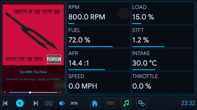
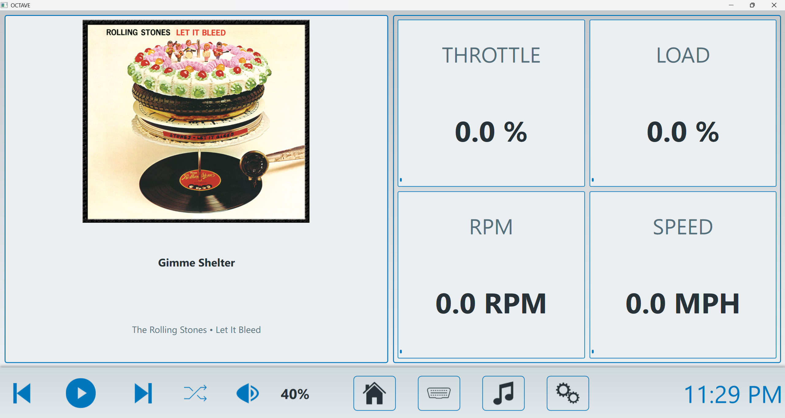
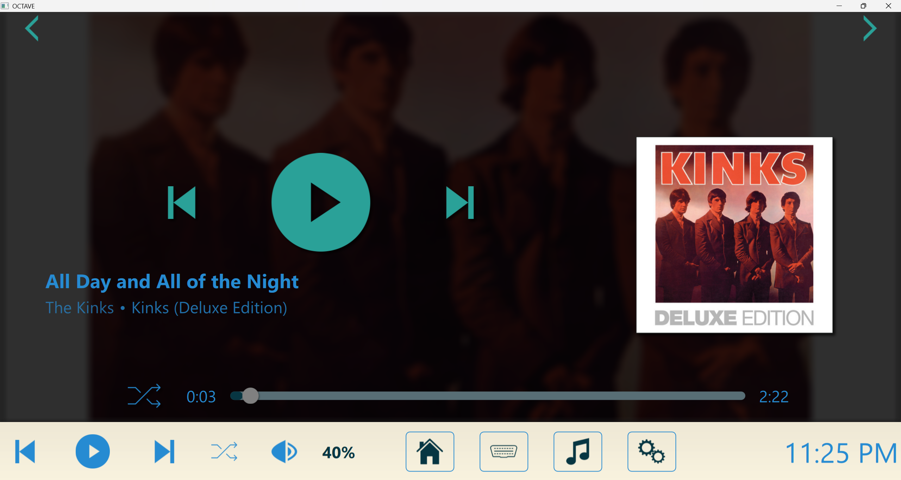
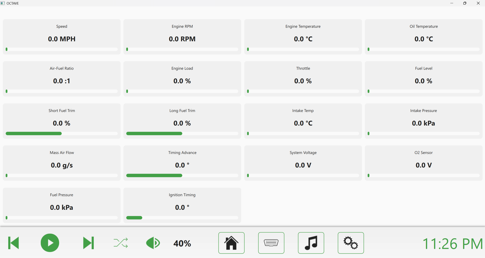

<div align="center">

# coscar-OS

### Open-source car infotainment · carputer · DIY head unit
**Raspberry Pi · Desktop · Android — fully programmable, hackable, MIT-licensed.**



[](https://github.com/EpicNori/coscar-OS/releases/latest)
[](https://github.com/EpicNori/coscar-OS/stargazers)
[](https://github.com/EpicNori/coscar-OS/releases)
[](LICENSE)

[](#pre-built-downloads)
[](#two-backends-one-frontend--built-for-the-community)
[](#)
[](https://github.com/EpicNori/coscar-OS/pulse)
[](https://github.com/EpicNori/coscar-OS/network/members)

### [Download Latest Release →](https://github.com/EpicNori/coscar-OS/releases/latest)

</div>

---

coscar-OS is an open-source infotainment system. A carputer you actually own. Rip out your factory head unit and bolt a Raspberry Pi to your dash, run it on a laptop in a project car, or sideload it onto an Android tablet. It plays your music, talks to your car over OBD-II, and themes itself to your album art.

If you've poked at **Crankshaft, OpenAuto Pro, or AGL** before, coscar-OS lives in the same neighborhood — closer to a hackable foundation than a polished product. Two backends ship side by side, C++/Qt and Python/PySide6, so you can fork whichever one you're already fluent in.

---

## Origin & Credits

coscar-OS is a redesign and continuation of the open-source [OCTAVE project](https://github.com/RobDeGeorge/OCTAVE), originally created by RobDeGeorge. The original MIT license, copyright notices, and attribution requirements are preserved in [`LICENSE`](LICENSE), [`NOTICE`](NOTICE), and [`ORIGINAL-CREDITS.md`](ORIGINAL-CREDITS.md).

## Why coscar-OS

Stock head units age out fast. Aftermarket units lock you in. Android Auto and CarPlay are great until you want to do something the manufacturer didn't sign off on.

coscar-OS is the third option: a stack you build, modify, and run on whatever hardware you want. If you've ever wanted to wire a rotary encoder to your dash, throw a custom OBD gauge on screen, or theme your UI to match your album art in real time, this is the project for you.

It's not really a product. It's more like vanilla Minecraft — I'll keep the base build healthy and supported, but the amount of customization baked in means no two coscar-OS installs are going to look the same. Themes, dashboards, layouts, hardware bindings, gauges, sensors, the lot. And if you want to go further than the built-in knobs allow, the whole thing is yours to fork.

## Who This Is For

- **The Pi tinkerer.** You've got a Raspberry Pi 4 or 5, a touchscreen, and a free weekend. You want a real infotainment stack to hack on, not a kiosk wrapped around a browser tab.
- **The factory-head-unit refugee.** Your 2008 Civic / E46 / Tacoma / van came with something terrible (or nothing at all), and you'd rather wire a tablet into the dash than drop $900 on a double-DIN.
- **The Android Auto / CarPlay defector.** Those are fine until you want to do something the manufacturer didn't sign off on. coscar-OS is the "do whatever you want" option.
- **The OBD-II data nerd.** You want live gauges, custom dashboards, and 50+ PIDs on screen without paying a subscription.
- **The van-build / overlander / project-car person.** You need an interface that survives being rebuilt three times and fits hardware nobody else supports.

## How It Compares

| | coscar-OS | Crankshaft | OpenAuto Pro | Stock Android Auto |
|---|---|---|---|---|
| Open source | yes (MIT) | yes | partial | no |
| Runs without a phone | yes | no (AA projection) | no (AA projection) | no |
| Built-in OBD-II + custom gauges | yes | no | limited | no |
| Themable / forkable UI | fully (QML) | limited | limited | no |
| Local music + Spotify + downloads | yes | via phone | via phone | via phone |
| Desktop dev loop | yes (Win/macOS/Linux) | Pi only | Pi only | n/a |

If you want a head unit that runs **on its own** instead of a screen that mirrors your phone, coscar-OS is the one.

## See It

<p align="center">
  
  
  
</p>

## What's In The Box

### Media & Audio
- Local player for MP3, M4A, FLAC with album art carousel and live FFT visualizer
- Spotify integration with OAuth2 and full device control
- Music search and download (Spotify metadata + YouTube audio)
- Dynamic theming that pulls colors straight from album art

### Vehicle & Hardware
- OBD-II diagnostics over ELM327 — 50+ live parameters, custom gauges, full dashboards
- ESP32 wireless volume knob with LED sync
- BerryIMU 9DOF sensor fusion (accelerometer, gyro, magnetometer, barometer)
- PAJ7620U2 gesture sensor for touchless control

### Platform & Customization
- Runs on Windows, macOS, Linux, Raspberry Pi, and Android
- Two parallel backends so you can hack in whichever language you'd rather live in
- 100+ user-configurable settings, all persisted to disk
- Custom gauge primitives and dashboard system — build your own and drop them in

## Installation guide

There are three ways to install coscar-OS. Choose the one that matches what you want to do:

1. **Pre-built release:** easiest for using coscar-OS as an end-user application.
2. **Python source install:** recommended for Raspberry Pi projects, hardware experiments, and Python/QML development.
3. **C++ source build:** recommended when you are working on the native application or creating a distributable desktop/mobile build. The complete toolchain matrix is in [BUILD.md](BUILD.md).

### Before you install

#### Supported systems

- Windows 10 or later, 64-bit
- macOS 10.14 or later
- Linux distributions with a working desktop session, including Debian/Ubuntu, Fedora, Arch, and Raspberry Pi OS
- Android arm64-v8a for the released APK/build path

The Python backend requires **Python 3.10 or 3.11**. The repository metadata intentionally limits it to `<3.12`; although the legacy installer check accepts some older Python versions, Python 3.10/3.11 is the supported range for the current dependency set.

You also need:

- Git, if you want to work from a Git checkout; the one-line archive installer below does not require Git
- An active display session for the graphical application; SSH-only and headless sessions cannot launch the normal UI without additional display forwarding
- Internet access during installation so pip can download Python packages
- Permission to install system packages on Linux; `setup.py` may invoke `sudo` for Qt, graphics, audio, X11, and input libraries

Do not run the installer as root. Run it as your normal user and allow the Linux package manager to request elevated access only when needed.

### One-line download and install

These commands download the current `main` source archive directly from GitHub,
so Git does not need to be installed first. Python 3.10 or 3.11 must already be
available. The kiosk variant starts fullscreen and enables per-user autostart.

**Windows PowerShell**

```powershell
$ErrorActionPreference='Stop'; $repo='coscar-OS'; if (!(Test-Path -LiteralPath (Join-Path $repo 'setup.py'))) { if (Test-Path -LiteralPath $repo) { throw "The folder coscar-OS already exists but is not a coscar-OS checkout." }; $zip=Join-Path $env:TEMP 'coscar-OS-main.zip'; $extract=Join-Path $env:TEMP 'coscar-OS-download'; Remove-Item -LiteralPath $extract -Recurse -Force -ErrorAction SilentlyContinue; Invoke-WebRequest -UseBasicParsing -Uri 'https://github.com/EpicNori/coscar-OS/archive/refs/heads/main.zip' -OutFile $zip; Expand-Archive -LiteralPath $zip -DestinationPath $extract -Force; Move-Item -LiteralPath (Join-Path $extract 'coscar-OS-main') -Destination $repo; Remove-Item -LiteralPath $zip,$extract -Recurse -Force }; Set-Location $repo; py -3.11 setup.py --kiosk --autostart
```

**macOS / Linux**

```bash
set -e; [ -f coscar-OS/setup.py ] || { test ! -e coscar-OS || { echo 'The folder coscar-OS already exists but is not a coscar-OS checkout.' >&2; exit 1; }; tmp="$(mktemp -d)"; curl -fL 'https://github.com/EpicNori/coscar-OS/archive/refs/heads/main.tar.gz' | tar -xz -C "$tmp"; mv "$tmp/coscar-OS-main" coscar-OS; rm -rf "$tmp"; }; cd coscar-OS && python3.11 setup.py --kiosk --autostart
```

For a normal windowed install, remove `--kiosk --autostart` from the final setup command.

### Option 1: Install a pre-built release

Download artifacts only from the official [GitHub Releases page](https://github.com/EpicNori/coscar-OS/releases). A release may contain these platform packages:

- **Windows:** `coscar-OS-<version>-windows-x86_64.exe` — run the installer and follow the wizard.
- **macOS:** `coscar-OS-<version>-macos.dmg` — open the disk image and drag the application to Applications.
- **Linux:** `coscar-OS-<version>-linux-x86_64.AppImage` — make it executable and start it:

  ```bash
  chmod +x coscar-OS-*.AppImage
  ./coscar-OS-*.AppImage
  ```

  Arch users may need FUSE 2:

  ```bash
  sudo pacman -S fuse2
  ```

  If FUSE is unavailable, use the AppImage fallback:

  ```bash
  ./coscar-OS-*.AppImage --appimage-extract-and-run
  ```

- **Android:** `coscar-OS-<version>-android-arm64-v8a.apk` — copy the APK to the device and install it through the file manager. Android may require enabling “Install unknown apps” for the file manager being used.

  The current CI release process creates a fresh signing key per build. Consequently, installing a newer APK may require uninstalling the previous coscar-OS APK first; uninstalling removes the app’s local data unless Android offers a backup/restore option.

If no compatible artifact is available for your device, use the Python or C++ source installation below.

### Option 2: Install the Python backend from source

This is the most useful path for a Raspberry Pi, a desktop development checkout, or custom hardware. The installer creates a local `venv` directory, upgrades pip, installs everything from `requirements.txt`, and then optionally launches the application.

#### Step 1 — Install prerequisites

Install Git and Python 3.10 or 3.11 using your operating system’s normal package manager.

**Windows** — install Python from [python.org](https://www.python.org/downloads/windows/) and enable the Python Launcher during setup. Confirm that PowerShell can find it:

```powershell
py --version
git --version
```

**macOS** — install the Xcode Command Line Tools and Python 3.11. Homebrew is optional, but the following is convenient if it is already installed:

```bash
xcode-select --install
brew install python@3.11 git
python3.11 --version
git --version
```

**Debian/Ubuntu/Raspberry Pi OS** — install Python, its virtual-environment module, and Git. Package names vary by distribution; on systems that provide Python 3.11 directly:

```bash
sudo apt update
sudo apt install -y git python3.11 python3.11-venv
python3.11 --version
git --version
```

If your distribution provides the supported interpreter as `python3` rather than `python3.11`, use that command consistently in the remaining steps. On Fedora, the equivalent prerequisite command is usually `sudo dnf install git python3.11`; on Arch, use `sudo pacman -S --needed git python`.

#### Step 2 — Clone the repository

Run these commands from the directory where you keep projects:

**Windows PowerShell**

```powershell
git clone https://github.com/EpicNori/coscar-OS.git
Set-Location coscar-OS
```

**macOS / Linux**

```bash
git clone https://github.com/EpicNori/coscar-OS.git
cd coscar-OS
```

#### Step 3 — Run the automated installer

Use `--no-run` for the first installation so that errors are easier to read and you can verify the setup before launching the UI.

**Windows PowerShell**

```powershell
py -3.11 setup.py --no-run
```

**macOS**

```bash
python3.11 setup.py --no-run
```

**Linux / Raspberry Pi OS**

```bash
python3.11 setup.py --no-run
```

On Linux, `setup.py` detects Debian/Ubuntu, Fedora/RHEL-family, Arch-family, or Raspberry Pi environments and attempts to install the required system libraries. It may ask for your sudo password. The Python packages are installed into `venv`, not into the global Python installation.

#### Step 4 — Start the application

Calling the virtual-environment interpreter directly is reliable and avoids accidentally using a different Python installation.

**Windows PowerShell**

```powershell
.\venv\Scripts\python.exe main.py
```

**macOS / Linux**

```bash
./venv/bin/python main.py
```

For verbose diagnostic logging, add `--debug`:

```bash
./venv/bin/python main.py --debug
```

On Windows, use `.\venv\Scripts\python.exe main.py --debug` instead.

You can also activate the environment first:

```bash
source venv/bin/activate            # macOS / Linux
python main.py
```

```powershell
.\venv\Scripts\Activate.ps1       # Windows PowerShell
python main.py
```

#### Installer modes

`setup.py` supports these modes:

| Command | What it does |
|---|---|
| `python setup.py` | Installs/updates the environment and launches the normal windowed app. |
| `python setup.py --no-run` | Installs/updates the environment without launching the app. |
| `python setup.py --kiosk` | Launches the app fullscreen for an in-car display. |
| `python setup.py --kiosk --autostart` | Installs kiosk mode and registers coscar-OS to start for the current user at login. |
| `python setup.py --autostart --no-run` | Registers normal windowed autostart without launching during setup. |
| `python main.py --debug` | Starts an already-installed environment with verbose logging. |

On Windows, replace `python` in setup commands with `py -3.11` if multiple Python versions are installed. On macOS/Linux, replace it with `python3.11` when that is the command that points to the supported interpreter.

In kiosk mode, close the application through **Settings → Display → Window → Exit coscar-OS**. Autostart is installed per user and does not require a system-wide service.

#### Optional manual installation

Use this only when you do not want `setup.py` to manage Linux system packages. Install the required Qt/display/audio libraries yourself first, then run:

```bash
python3.11 -m venv venv
source venv/bin/activate
python -m pip install --upgrade pip
python -m pip install -r requirements.txt
python main.py
```

On Windows, use `py -3.11 -m venv venv`, activate with `.\venv\Scripts\Activate.ps1`, and run the same pip/application commands. The repository’s `requirements.txt` is the source-install dependency list; `pyproject.toml` documents the supported Python range and project metadata.

### Option 3: Build the native C++ application

The native build requires **CMake 3.21+**, **Qt 6.7.3**, a platform compiler, and (on Windows) the vcpkg `taglib` dependency. The shortest desktop build is:

```bash
git clone https://github.com/EpicNori/coscar-OS.git
cd coscar-OS
cmake -S . -B build -DCMAKE_BUILD_TYPE=Debug
cmake --build build -j
```

Run `./build/octave` on Linux/macOS. On Visual Studio multi-config builds, run `build\\Debug\\octave.exe` or `build\\Release\\octave.exe` on Windows. For platform-specific Qt installation, AppImage packaging, Windows installers, Android APKs, and CI-matching versions, follow [BUILD.md](BUILD.md).

### First-run configuration

After the application opens, configure hardware and services from **Settings**. Most settings are stored per user in these locations:

| Platform | Configuration directory |
|---|---|
| Windows | `%APPDATA%\\coscar-OS` |
| macOS | `~/Library/Application Support/coscar-OS` |
| Linux / Raspberry Pi OS | `${XDG_CONFIG_HOME:-~/.config}/coscar-OS` |

#### Spotify

Spotify is optional. To enable it:

1. Create a Spotify application in the [Spotify Developer Dashboard](https://developer.spotify.com/dashboard).
2. Add this exact redirect URI to that application: `http://127.0.0.1:8888/callback`.
3. Open **Settings → Media**, enter the Spotify Client ID and Client Secret, and save them.
4. Start the Spotify authentication flow and approve access in the browser.
5. Keep Spotify open on at least one available Spotify Connect device for playback control.

Never commit the Client Secret, token cache, or settings directory to Git. coscar-OS stores the Spotify Client ID and Client Secret in its per-user settings; the OAuth token cache uses the operating-system keyring when available.

#### OBD-II and sensors

OBD-II, ESP32, BerryIMU, and gesture hardware are optional. Install the application and confirm that the normal UI works before connecting vehicle hardware. Then configure the relevant port or device in Settings. Do not test a new adapter while driving; use a parked vehicle and follow the adapter manufacturer’s electrical and safety instructions.

#### YouTube downloads

YouTube downloads are optional and can be affected by network reputation, regional restrictions, or bot detection. See [YouTube downloads failing?](#youtube-downloads-failing-check-your-vpn-first) for the supported cookie-file fallback. Treat `youtube_cookies.txt` as sensitive: it contains session cookies and must never be committed or shared.

### Updating, resetting, and uninstalling

To update a source checkout, stop coscar-OS first and run:

```bash
git pull --ff-only
./venv/bin/python setup.py --no-run
```

Use `.\\venv\\Scripts\\python.exe setup.py --no-run` on Windows. The installer reuses a valid virtual environment and reinstalls the current requirements. If the environment was copied from another operating system or has a broken interpreter, `setup.py` may recreate it; close all coscar-OS/Python processes first.

To reset application settings, exit coscar-OS and back up, then remove only the per-user configuration directory listed above. This resets credentials, themes, dashboards, and device settings; it does not change the Git checkout. To remove a source installation, delete the checkout after disabling its per-user autostart entry. Use your operating system’s normal uninstall mechanism for pre-built packages.

### Troubleshooting installation

| Symptom | Fix |
|---|---|
| `python` or `py` is not recognized | Install Python 3.10/3.11, reopen the terminal, and verify `python --version`, `python3.11 --version`, or `py --version`. |
| `No module named PySide6` or another dependency | Run the app with the venv interpreter: `./venv/bin/python main.py` or `.\\venv\\Scripts\\python.exe main.py`. If needed, rerun `setup.py --no-run`. |
| `ensurepip`/venv creation fails on Linux | Install the matching venv package, for example `sudo apt install python3.11-venv`, then rerun setup. |
| Qt platform/plugin/display errors | Start from a real desktop session. For WSL, use WSLg on Windows 11, configure an X server on Windows 10, or run directly on Windows. |
| Linux packages fail during setup | Install the missing packages with the detected package manager, then rerun `python3.11 setup.py --no-run`. Do not ignore a failed Qt, OpenGL, XCB, or audio dependency installation. |
| Spotify authentication returns to the wrong page | Confirm the redirect URI is exactly `http://127.0.0.1:8888/callback`, including the address and port, and make sure a local firewall is not blocking the callback. |
| A new Android APK says it cannot update | Uninstall the previous per-build-signed APK, then install the new APK. This removes the previous app data. |

### Updating from home Wi-Fi

Connect the car to your home Wi-Fi, then open **Settings → Device → Home Wi-Fi Update**. coscar-OS checks GitHub over HTTPS, downloads the latest `main` revision, verifies that the new Python entry point parses, and offers a restart. Updates are manual and roll back if the update fails.

If you are developing the project, also review [BUILD.md](BUILD.md), the [wiki](wiki/index.html), and [docs/GAUGE_AUTHORING.md](docs/GAUGE_AUTHORING.md).

### YouTube downloads failing? Check your VPN first.

**99% of the time the fix is to turn off your VPN.** YouTube's bot detection blocklists most VPN exit IPs (NordVPN, ExpressVPN, Mullvad, ProtonVPN, etc. — they're shared with thousands of automated tools), and every download will fail with *"Sign in to confirm you're not a bot"* until you reconnect on a residential IP. If you need to stay on a VPN, switch to a residential-IP plan or a dedicated-IP exit node.

If turning off the VPN isn't an option (geo-restricted regions, privacy requirements), you can authenticate with your YouTube account via cookies as a fallback:

1. Install the **Get cookies.txt LOCALLY** extension in any Chromium-based browser:
   - Desktop: Chrome / Brave / Edge / Vivaldi.
   - Android: **Kiwi Browser** or **Brave** (Chrome on Android doesn't support extensions).
2. Log into <https://www.youtube.com> in that browser.
3. Click the extension's icon while on a YouTube tab → **Export → cookies.txt**.
4. Save (or rename) the file to `youtube_cookies.txt` in your **Downloads** folder:
   - **Linux / macOS:** `~/Downloads/youtube_cookies.txt`
   - **Windows:** `%USERPROFILE%\Downloads\youtube_cookies.txt`
   - **Android:** `/storage/emulated/0/Download/youtube_cookies.txt` (visible as `Internal storage / Download / youtube_cookies.txt` in any file manager)
5. Restart coscar-OS — every download will now use those cookies. Cookies usually stay valid for weeks.

coscar-OS detects the file automatically — no settings to configure. If you don't have the file, downloads still work for any video that isn't currently walled by YouTube on your network.

## Two backends, one frontend

This is the part I care about most.

coscar-OS ships **two parallel backends**, C++ / Qt 6 and Python / PySide6, both driving the same QML frontend. Not because the project needs both, but because **you** might. The whole reason it exists in two languages is so the next person to fork coscar-OS can pick up the side they already speak and start building.

- Love C++? `src/` is yours. Performance, app stores, mobile — that's the side that ships natively.
- Live in Python? `backend/` is yours. Want to wire up a weird sensor on a Pi at 2am with a REPL open? Done in 20 lines.

The frontend doesn't know or care which one is running. Mod whichever side you want, ship to whoever you want.

You don't have to fork to make coscar-OS yours — most of the customization is just settings, themes, and dashboards you build inside the app. But if you do want to fork and ship something I'd never have thought of, the wild rigs and weird hardware ports are the part I'm most excited to see.

## System Requirements

- **Python** 3.10 or 3.11 (for the Python backend) / **Qt 6.7.3** + **CMake 3.21+** (for C++)
- **OS:** Windows 10+, macOS 10.14+, Linux (Debian / Arch / Fedora), Raspberry Pi OS, Android

## Roadmap

A few of the bigger things in flight — full plans live under [`TODO/`](TODO/):

- **Drag-and-drop dashboard editor** — Tony Hawk create-a-park, but for OBD gauges. See [`TODO/dashboards-roadmap.md`](TODO/dashboards-roadmap.md).
- **Native C++ Android port** — App Store / Play Store distribution. See [`TODO/android-cpp-port.md`](TODO/android-cpp-port.md).
- **In-app error notification UI** — surface backend issues without diving into log files.
- **Expanded test coverage** — beyond the current smoke suite.

## Documentation

The wiki covers everything — architecture, every backend manager, every frontend page, settings reference, hardware setup, build guides, the gauge authoring spec — start at [`wiki/index.html`](wiki/index.html). For building gauges and dashboards specifically, [`docs/GAUGE_AUTHORING.md`](docs/GAUGE_AUTHORING.md) is the source of truth.

## Star History

<a href="https://star-history.com/#EpicNori/coscar-OS&Date">
  
</a>

## Contributing

Pull requests welcome. Bug reports welcome. Hardware mods extremely welcome.

If you build something cool on top of coscar-OS — a custom dashboard, a new sensor integration, a port to weirder hardware — open an issue or PR and show it off. The more wild builds out there, the better the project gets.

Star the repo if you want to follow along.

## License

2026 [Way Better Solutions](https://waybetter.solutions/) — MIT License. Do whatever you want with it.
